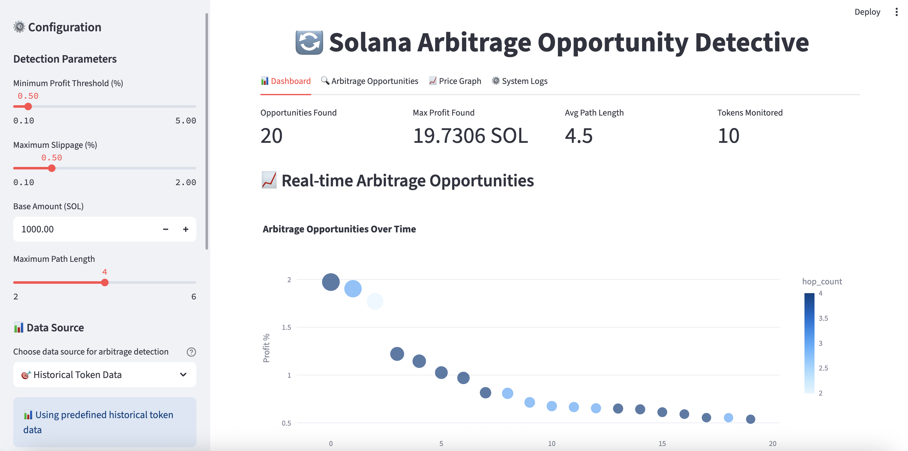
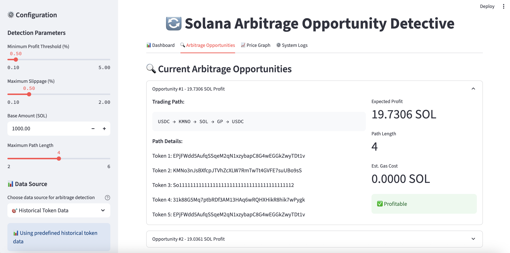

graph_utils:

- add new method to use symbol for display instead of long address
- add seperate interface for console and streamlit frontend

graph_structure：

- 修改 build_graph_from_edge_lists()保存 symbol 信息到边属性中
  = 现在图的边包含 from_symbol 和 to_symbol 属性

algorithms + risk_evaluator:

- add config as default, eliminate magic numbers
- delete unused function
- enhance readability

检查单位问题：

- 修改了 price_impact_pct 在算法中的应用
- gas fee: lamports→SOL

bellman-ford 算法存在的问题

# Table of Contents

1. [Features](#features)
2. [Preview](#preview)
3. [Prerequisite](#prerequisite)
4. [Usage](#usage)

## Features

- **Real-time Data Monitoring**
- **Arbitrage Opportunity Detection**

## Preview




## Prerequisite

- Python 3.8+
- Streamlit 1.28.0
- Other dependencies (check [requirements.txt](requirements.txt))

## Installation

### Clone The Repository:

```bash
git clone https://github.com/yixu9-hub/Crypto-Arbitrage-Detector.git
```

### Create a Virtual Environment:

#### Create:

- **For Windows:**

```bash
python -m venv venv
```

- **For macOS/Linux:**

```bash
python3 -m venv venv
```

#### Activate:

- **For Windows:**

```bash
venv\Scripts\activate
```

- **For macOS/Linux:**

```bash
source venv/bin/activate
```

### Install Dependencies:

```bash
pip install -r requirements.txt
```

### Run:

```bash
streamlit run app.py
```

## Usage

1. Refresh data when the token information expired
2. Choose detection parameters(e.g. profit threshold, max slippage, etc.)
3. Choose data source
4. Choose algorithm you want to use to detect arbitrage opportunites
5. Click start to generate arbitrage opportunites
